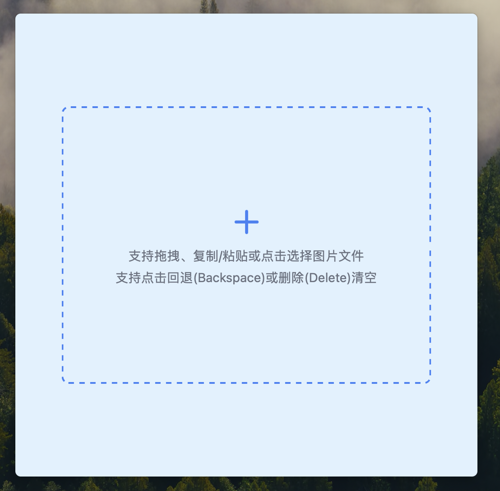
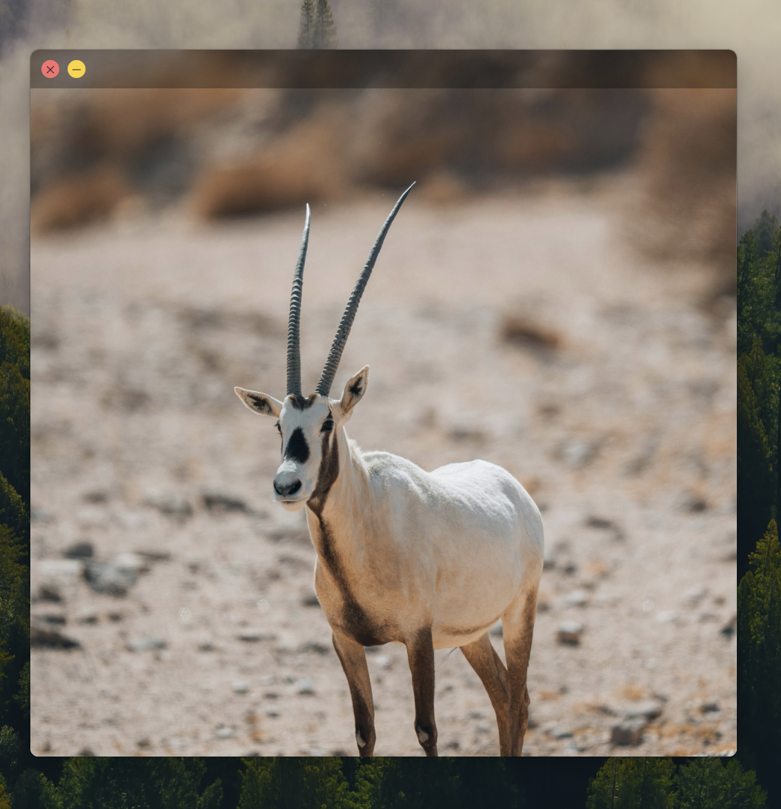

  
  <h1>Topping</h1>

基于[wails](https://wails.io/)开发的桌面应用程序，用于悬浮指定图片，支持本地拖拽图片、复制粘贴(本地或网络)图片等方式悬浮置顶图片。

支持本地拖拽/选择图片、复制粘贴(本地或网络)图片方式悬浮图片置顶层。
支持键盘回退键(Backspace)和删除键(Delete)删除置顶图片。

# Stacks

- [wails](https://wails.io/)
- [go](https://go.dev/)
- [react](https://react.dev/)
- [tailwindcss](https://tailwindcss.com/)
